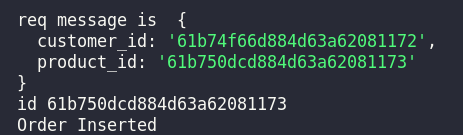

# **Phone Shop Product Order API** 

## **Description** 
_back-end application that allows the user to manage customers, stock and orders_<br/><br/>

## **Project Goal**
To provide full CRUD functionality for an order management system<br/><br/>

## **Tech Used**<br/>


<br/><br/>

# **Features**<br/>
### *Data Model*

Embedded documents for addresses in customer collection (customer details (addresses: [home, shipping]))

Many-to-Many (customer has many ordered products/products ordered by many customers) this is the likely scenario, if the databases scale grew
embedding all ordered products into each customer document may cause more overhead that outweighs the benefits of denormalized data and query efficiency for customers orders. For this reason orders will be stand alone collections and normalized by referencing ObjectIds of cutomers and products

Orders collection will contain an ObjectId for each order, each order will contain the id of the customer who has made the order and the id of the products
<br/><br/>


## **SAMPLE CRUD CONSOLE OUTPUT**

### **Create a Customer**
<br/>


### **Update a Customer** (mobile number update)
<br/>


### **Create a Product**
<br/>


### **Update a Product** (manufacturer name and price update)
<br/>


### **Create an Order**
<br/>


### **Read all Orders**
<br/>


### **Delete an Order** 
<br/>


# **To Run This Project**

```
$ git clone https://github.com/jphoulihan/phone_shop.git
```
<br/>

_In project root directory_

```
$ npm i
```

_Run in app/src directory_
```
$ node app.js
```

<br/><br/>

# **Learning Outcomes**
* NoSQL Document Model
* Complete CRUD operations on Node server with Express and Mongoose
* Async await functions 


<br/><br/>

# **Future Development**

* Add front-end 
* Deploy application to the web 
<br /><br />

### **Created by**

- [John Houlihan](https://github.com/jphoulihan "Visit John's GitHub")<br/><br/>

### **License**

[](https://opensource.org/licenses/MIT)

